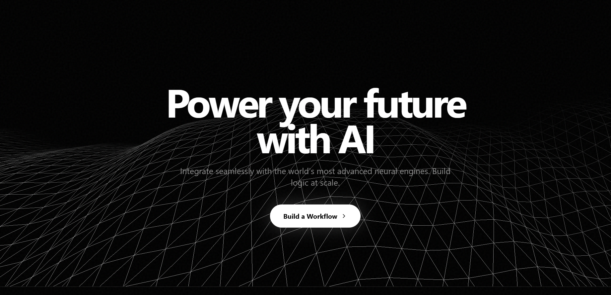
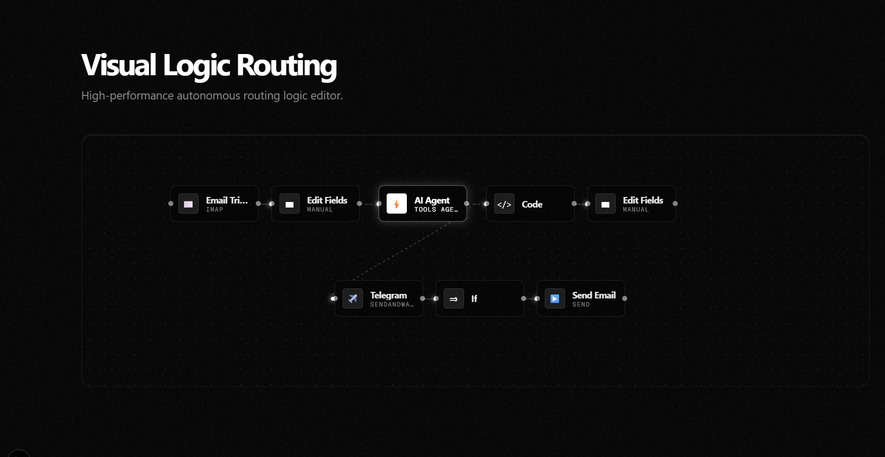
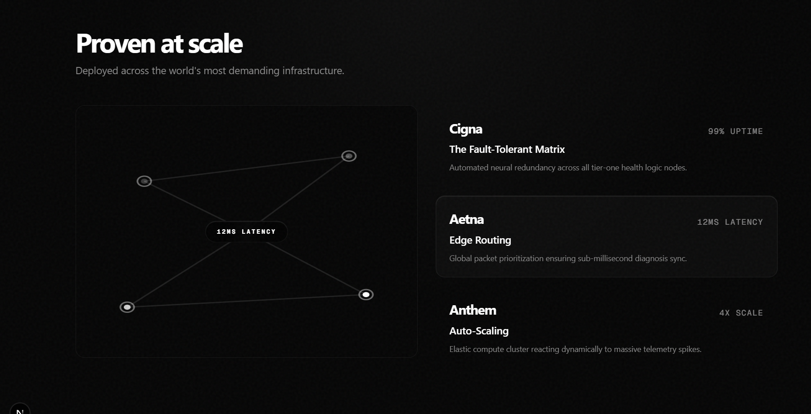
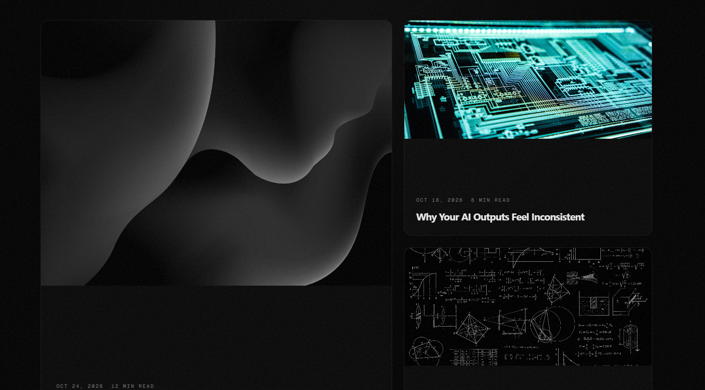
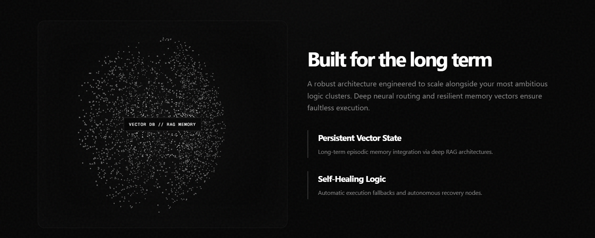
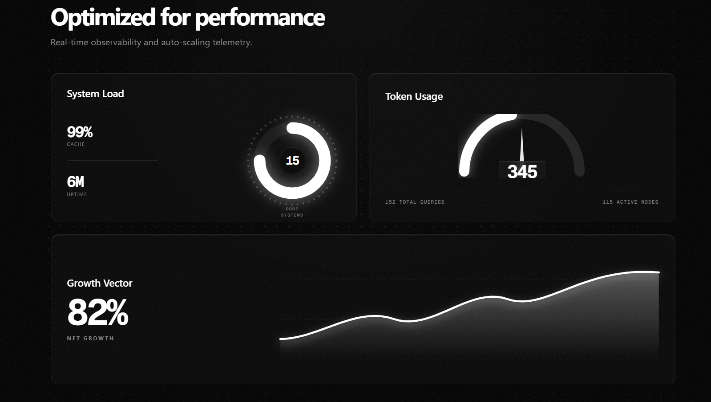

# AI Workflow Landing Page

A modern AI-themed landing page built with **Next.js 14**, **React**, and **Tailwind CSS**.

This project focuses on creating a premium user experience with smooth animations, reusable UI components, SVG-based workflow visualizations, and a responsive layout. It was built to explore advanced frontend concepts while keeping the code modular and maintainable.

---

## Preview

### Hero Section



### Workflow Canvas



### Infrastructure Section



### Articles



### Architecture



### Dashboard



---

## Features

- Modern AI-inspired landing page
- Responsive design for desktop and mobile
- Interactive SVG workflow connections
- Smooth animations and transitions
- Reusable React components
- Dark UI with glassmorphism effects
- Performance-focused architecture
- Built using the Next.js App Router

---

## Tech Stack

| Technology     | Purpose                |
| -------------- | ---------------------- |
| Next.js 14     | Framework              |
| React          | UI Library             |
| Tailwind CSS   | Styling                |
| TypeScript     | Type Safety            |
| SVG            | Workflow Visualization |
| CSS Animations | Micro Interactions     |

---

## Project Highlights

### Interactive Workflow Canvas

The workflow section is built using native SVG paths instead of external libraries. Each connection is generated dynamically using cubic Bezier curves, creating a smooth flow between nodes.

It also includes animated data packets moving along the SVG paths to simulate real-time communication between workflow steps.

---

### Responsive Layout

The UI uses a combination of CSS Grid and Flexbox to ensure the layout adapts smoothly across different screen sizes.

Every section has been designed with responsiveness in mind without relying on separate mobile components.

---

### Reusable Components

The project follows a modular component structure where each UI block is isolated into reusable components.

Examples include:

- Workflow Canvas
- Feature Cards
- Dashboard Widgets
- Navigation
- Hero Section
- Animated Statistics

---

### Modern UI Design

The interface uses a dark theme with subtle glassmorphism effects, soft shadows, gradients, and blur effects to create a clean and futuristic appearance.

---

### Performance

Some optimizations used in this project include:

- Next.js App Router
- Optimized rendering
- Hardware-accelerated CSS animations
- Lightweight SVG graphics
- Component-based architecture

---

## Folder Structure

```text
app/
components/
public/
styles/
lib/
```

---

## Getting Started

Clone the repository

```bash
git clone https://github.com/bloody14/AI_Workflow_UI.git
```

Go into the project

```bash
cd AI_Workflow_UI
```

Install dependencies

```bash
npm install
```

Start the development server

```bash
npm run dev
```

Open your browser and visit

```
http://localhost:3000
```

---

## What I Learned

While building this project I explored:

- Advanced component architecture
- SVG path generation
- Responsive UI development
- Tailwind CSS best practices
- Animation lifecycle management
- Performance optimization in React
- Building scalable frontend projects

---

## Future Improvements

- Dark/Light theme toggle
- More workflow interactions
- Accessibility improvements
- Better mobile animations
- Backend integration
- AI workflow editor

---

## Screenshots

| Hero | Workflow                           |
| ---- | ---------------------------------- |
|      |  |

| Dashboard                        | Architecture                        |
| -------------------------------- | ----------------------------------- |
|  |  |

---

## Author

**Kundan Singh**

GitHub: https://github.com/bloody14

LinkedIn: https://linkedin.com/in/kundan-singh-95b72824a

---

## License

This project is licensed under the MIT License.